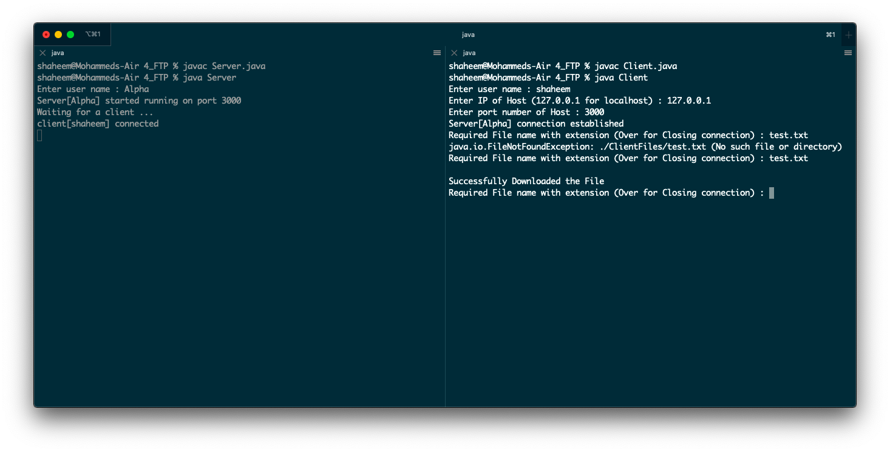

## FTP Client Server Communication over TCP


Implemented using Java Sockets

### Usage

Run Server and Client programs in separate machines or separate terminals

#### Server

```html
javac Server.java
java Server

Enter user name : [username_of_server]
Server[username_of_server] started running on port 3000
Waiting for a client ...
```

#### Client
```html
javac Client.java
java Client

Enter user name : [client_username]
Enter IP of Host (127.0.0.1 for localhost) : [ip_of_host_machine]
Enter port number of Host : [program_runnig_port]
Server[username_of_server] connection established
```

### Todos

 - Create a folder named ClientFiles if not exists
 - Create a folder named ServerFiles if not exists
 - Add Necessary files to ServerFiles folder

### Preview


